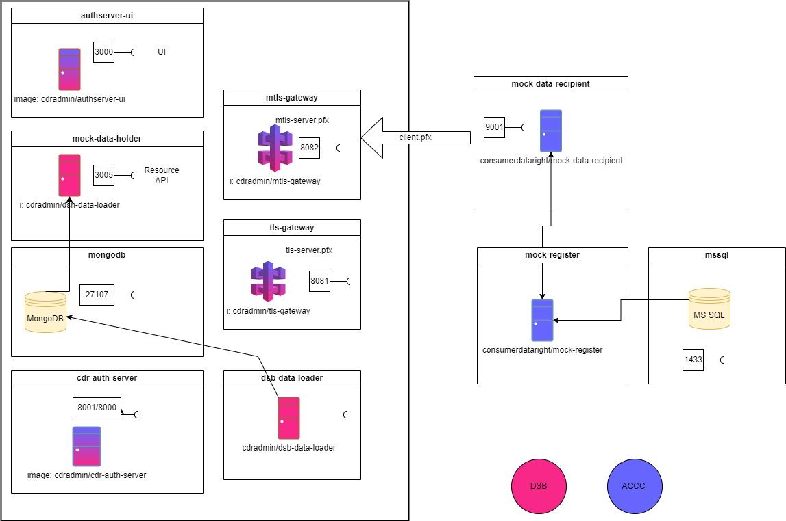

# Mock Data Holder (NodeJS)

## Overview

The Mock Data Holder (NodeJS) is a reference implementation of a CDR Data Holder solution, designed to support the Consumer Data Right (CDR) implementation journey. It aims to assist CDR participants in developing their own Data Holder (DH) systems that comply with Consumer Data Standards. The system consist of a number of docker containers, some of which are maintained by the ACCC, others are maintained by the Data Standards Body.



## Using the Mock Data Holder

The Data Standards Body provides relevant docker images in the DockerHub. You can skip the local setup and run the images to get a Mock CDR Environment running on your computer, including a Mock Data Holder (NodeJS), an auth server, a Mock Data Recipient and a Mock Register. For more information, refer to the [Quick Start with Docker Compose](#quick-start-with-docker-compose) section below.

You can also set up a local instance of the Mock Data Holder (NodeJS) for customised and extended use cases. For more information, refer to the [Local Setup and Customisation](#local-setup-and-customisation) section below. 

You can easily interact with and explore CDR APIs using the Mock ADR, or using our comprehensive Postman collection.

This solution:

- is maintained regularly to ensure compatibility with the latest Consumer Data Standards.
- assists Data Holders with regulatory adherence through accurate request and response simulations.
- provides Docker Support to simplify deployment and testing across various environments, with ready-to-use Docker images available on DockerHub, eliminating the need for local builds.
- strictly follows the [CDS Guidelines](https://consumerdatastandardsaustralia.github.io/standards/#http-headers) for handling the request and response HTTP headers accurately.
- utilises the [NPM package](https://www.npmjs.com/package/@types/consumer-data-standards) to include the CDS-specific Type Definitions, maintained by the DSB.
- utilises the [Holder SDK](https://www.npmjs.com/package/@cds-au/holder-sdk) NPM package, maintained by the DSB.
- utilises test data generated by DSB’s [Test Data CLI](https://github.com/ConsumerDataStandardsAustralia/testdata-cli) Tool for populating the database to mimic various real-world scenarios for thorough testing.

## Quick Start with Docker Compose

1. Download the Docker Compose file from this [link](https://github.com/ConsumerDataStandardsAustralia/mock-data-holder-nodejs/blob/master/docker-compose.yaml).
2. Download the Docker environment file from this [link](https://github.com/ConsumerDataStandardsAustralia/mock-data-holder-nodejs/blob/master/.env.docker) into the same folder.
3. Open a terminal and navigate to the directory where the Docker Compose file is located.
4. Navigate to the root directory of the repository and the run the following command to start the services defined in the Docker Compose file:
    
    ```bash
    docker-compose -f docker-compose.yaml up -d
    ```
    
    This command will automatically pull the necessary Docker images and create the containers required for the Mock Data Holder, setting up everything you need to get started without manually handling the code repository.
    
4. Open your web browser and navigate to the desired API endpoints using [https://localhost:8082](https://localhost:8082/) as the base URL for the Mock Data Holder (NodeJS) application. For example, you can obtain a list of energy plans from [https://localhost:8082/cds-au/v1/energy/plans](https://localhost:8082/cds-au/v1/energy/plans).
5. To obtain a new access token required to call the resource APIs, navigate to [https://localhost:9001](https://localhost:9001/) to initiate the PAR login sequence. This access token can then be used for API access, for instance, with the DSB Postman collection.

## Quick Start with Docker Compose - Running without authorisation

This is an alternative and simplified run mode.
In this mode the mock-data-holder simply serves the API. No valid token is required, the assumed user is set in the environment file, and all accounts for that user are assumed to have been given consent.

If an access token is found the request header and a `scopes` property (space delimted string) is found, then these scopes will be used. If no token is found, then all scopes are assumed to be valid.

To run in this mode

1. Download the Docker Compose file (noauth) from this [link](https://github.com/ConsumerDataStandardsAustralia/mock-data-holder-nodejs/blob/master/docker-compose.noauth.yaml).
2. Download the Docker environment (noauth) file from this [link](https://github.com/ConsumerDataStandardsAustralia/mock-data-holder-nodejs/blob/master/.env.noauth) into the same folder.

    ```bash
    docker-compose -f docker-compose.noauth.yaml up -d
    ```
*Note the additional setting `NO_AUTH_SERVER="true"` in the .env.noauth file*

## Local Setup and Customisation

### Prerequisites

1. Docker
    - Docker installed (verified with v 24.0.2)
    - Docker Compose installed (verified with v2.19.1)
2. Trusted Certificates
    
    All certificates used with this ecosystem have been generated with the CA which can be found in `security\\cdr-auth-server\\nginx\\ssl`.
    
    The CA certificate in this folder needs to be trusted by your browser, ie be a "Trusted CA". Dependent on which OS, what security settings, and other parameters this may differ for each user.
    
3. Host file entries
    
    A number of entries are required in the `host` file. These entries typically are in *C:\Windows\System32\drivers\etc\hosts* on Windows platforms, */etc/hosts* on UNIX/Linux and */private/etc/hosts* on MacOS (although this may be different).
    
    - 127.0.0.1 mock-data-holder
    - 127.0.0.1 mock-data-recipient
    - 127.0.0.1 mock-data-holder-energy
    - 127.0.0.1 mock-register
    - 127.0.0.1 mtls-gateway
    - 127.0.0.1 tls-gateway
    - 127.0.0.1 authserver-ui
    - 127.0.0.1 cdr-auth-server
4. NodeJS (verified with v18.19.0)

### Installation

1. Create a fork of this repository. To do this, click the "Fork" button on the top right corner of this page.
2. After forking the repository, clone it to your local machine. You can do this by running the following command in your terminal or command prompt:
    
    ```bash
    git clone <https://github.com/your-username/project-name.git>
    ```
    
    Replace **`your-username`** with your GitHub username and **`project-name`** with the name of your repository.
    
3. Once the repository is cloned, navigate to the project directory by running:
    
    ```bash
    cd project-name
    ```
    
    Replace **`project-name`** with the name of the repository.
    

### Build

1. Customise the data holder project as needed for your specific use case. 
2. Navigate to the project directory and execute the following command:

```bash
npm run build
```

Note: A custom build can be run from any debug environment and will interact with the other containers (eg databases). 

### Run

1. Navigate to the root directory of the repository and the run the following command to start the services defined in the Docker Compose file:
    
    ```bash
    docker-compose up
    ```
    
    This command will automatically pull the necessary Docker images and create the containers required for the Mock Data Holder, setting up everything you need to get started without manually handling the code repository. 
    
2. Now **stop** the Mock data holder container by running the following command:
    
    ```bash
    docker stop mock-data-holder
    ```
    
3. Start the development server by running the following command in the project directory:
    
    ```bash
    npm start
    ```
    
4. Open your web browser and navigate to [http://localhost:9001](http://localhost:9001/) to access the Mock Data Recipient application. This application can be used to generate an access token required to access the API.

## Contribution Process

We welcome contributions from the community! If you'd like to contribute to this project, please follow these simple steps:

1. Create a new branch for your work from the `master` branch:
    
    ```bash
    git checkout -b feature/your-feature-name
    ```
    
2. Begin making your changes or contributions.
3. Follow the instructions in the project repository to run and test your changes locally.
4. Commit your changes with clear and concise commit messages.
5. Push your changes to your forked repository.
6. Open a pull request (PR) using the `master` branch in the [original repository](https://github.com/ConsumerDataStandardsAustralia/mock-data-holder-nodejs/) as the destination branch. Include a detailed description of your changes and the problem you are addressing.
7. Engage in the discussion on your PR and make any necessary adjustments based on feedback from maintainers and other contributors.
8. Once your PR is approved and all tests pass, it will be merged into the project.

### Note:

1. Please ensure your contributions align with our project's objectives and [guidelines](https://d61cds.notion.site/Contribution-Guidelines-8b99d030fea946668fbc75444197e68b?pvs=4).

## Using Postman to call the Data holder APIs

Our Postman collection includes pre-configured environments and requests that mirror typical interactions with our Mock Data Holder's APIs, and allows us to test functionality, response formats, and error handling seamlessly.


## Reporting Issues

Encountered an issue? We're here to help. Please visit our [issue reporting guidelines](https://d61cds.notion.site/Issue-Reporting-Guidelines-71a329a0658c4b69a232eab95822509b?pvs=4) for submitting an issue.

## Stay Updated

Join our newsletter to receive the latest updates, release notes, and alerts. [Subscribe here](https://consumerdatastandards.us18.list-manage.com/subscribe?u=fb3bcb1ec5662d9767ab3c414&id=a4414b3906).

## License

The artefact is released under the [MIT License](https://github.com/ConsumerDataRight/mock-register/blob/main/LICENSE), which allows the community to use and modify it freely.

## Disclaimer

The artefacts in this repository are offered without warranty or liability, in accordance with the [MIT licence.](https://github.com/ConsumerDataStandardsAustralia/java-artefacts/blob/master/LICENSE)

[The Data Standards Body](https://www.csiro.au/en/News/News-releases/2018/Data61-appointed-to-Data-Standards-Body-role) (DSB) develops these artefacts in the course of its work, in order to perform quality assurance on the Australian Consumer Data Right Standards (Data Standards).

The DSB makes this repository, and its artefacts, public [on a non-commercial basis](https://github.com/ConsumerDataStandardsAustralia/java-artefacts/blob/master/LICENSE) in the interest of supporting the participants in the CDR ecosystem.

The resources of the DSB are primarily directed towards assisting the [Data Standards Chair](https://consumerdatastandards.gov.au/about/) for [developing the Data Standards](https://github.com/ConsumerDataStandardsAustralia/standards).

Consequently, the development work provided on the artefacts in this repository is on a best-effort basis, and the DSB acknowledges the use of these tools alone is not sufficient for, nor should they be relied upon with respect to [accreditation](https://www.accc.gov.au/focus-areas/consumer-data-right-cdr-0/cdr-draft-accreditation-guidelines), conformance, or compliance purposes.
